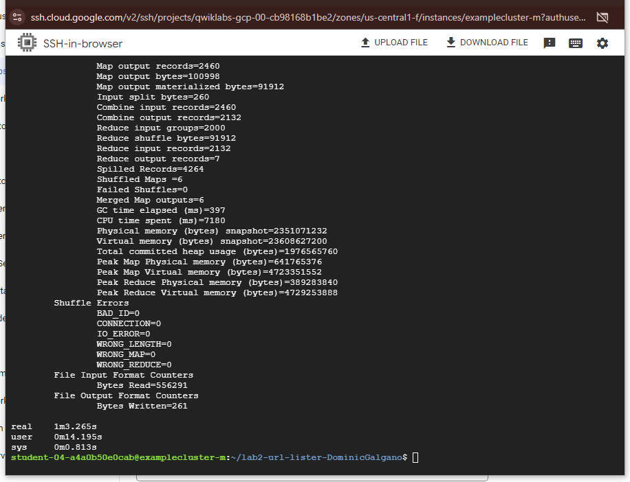
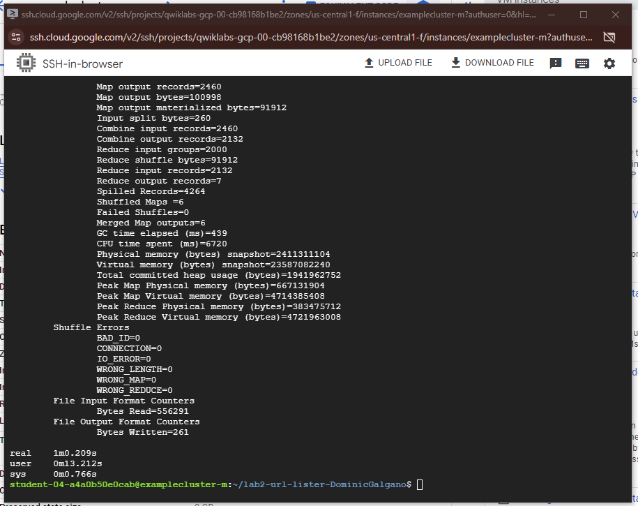

# Lab 2 - Convert WordCount to UrlCount

## Software Explanation
1. Converted WordCount1.java to UrlCount1.java by modifying the TokenizerMapper Class, specifically the map function within this class. I used the Pattern and Matcher objects from the java.util.regex package to find all the URLs in the html texts. It then maps each Url as a key to a value of one.
2. I left the combiner untouched. The combiner is very similar to the reduce because it reduces the key, pairs locally before the entire map is passed to the reducer for complete reduction. 
3. The Reducer uses an efficient algorithm to find all keys which are the same and sums their values into one total value. It then stores the key and the total value as a pair. In this code it only writes the key value pair to the output file if the value is greater than 5.

## Resources used
 - Hadoop Tutorial: https://hadoop.apache.org/docs/r3.0.3/hadoop-mapreduce-client/hadoop-mapreduce-client-core/MapReduceTutorial.html
 - Java Regex Tutorial: https://www.vogella.com/tutorials/JavaRegularExpressions/article.html
 - Java Docs for Pattern and Matcher Objects: https://docs.oracle.com/javase/8/docs/api/java/util/regex/Pattern.html
 
## Java Combiner Problem
If you don't ensure to implement the combiner with both associative & commutative
operators it can cause the combiner to miscount and change the overall result once passed to the reducer. Additionally, since combiners are run locally it is important that duplicate key,value pairs are not distributed to each worker as this would also cause errors since each worker is combining independently from the the other workers.

## Dataproc Results
Command used for results: `time hadoop jar UrlCount1.jar UrlCount1 input output`

Results when running job with 2 worker nodes:

Results when running job with 4 worker nodes:

As seen in the screen shots, the 4 worker nodes offered slightly faster completion speed compared to the 2 worker nodes, which was expected. However, it was surprising the increase in speed was only 3 seconds. This may be due to the relatively small size of the job, making it difficult for the additional nodes to have a significant effect on the overall efficiency/completion time. 
